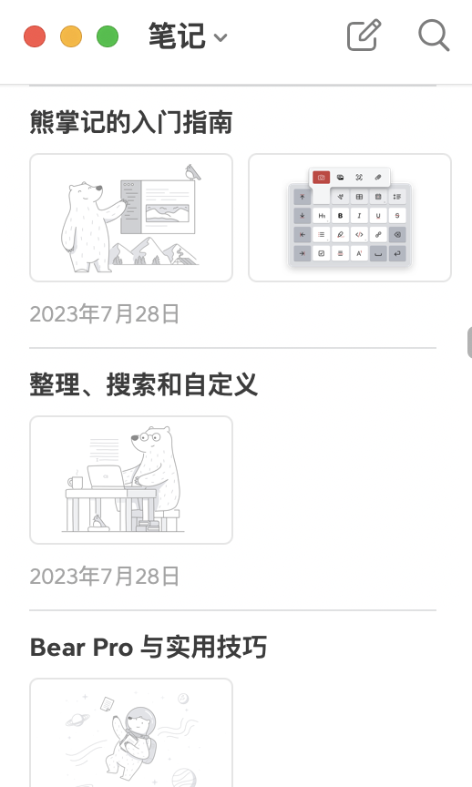
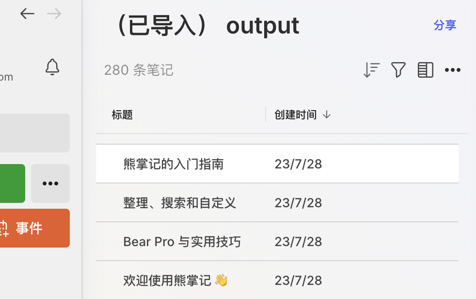

# bearMD2enex

`bearMD2enex` is a tool to convert Markdown files exported from Bear into the ENEX format used by Evernote. This tool preserves the file format, creation time, and title during the conversion.

## Purpose

This conversion script is designed to help you transfer Bear notes to other note-taking software.

## Instructions

1. **Export from Bear**:
   - Open Bear and export the entire notebook.
   - Select the Markdown format for export.
   - Choose to split the file export if necessary.
   - It is recommended not to include base64 images as they have not been tested.

2. **Prepare Your Files**:
   - Place the Markdown files in the `source` directory of the current project.

3. **Run the Conversion**:
   - Execute `bearMD2enex.py` to start the conversion process.
   - The output will be an `output.enex` file generated in the current directory.

4. **Import to Evernote**:
   - Import the `output.enex` file into Evernote.

## Example Images

Here are some example images:

<table style="width: 100%; text-align: center;">
  <tr>
    <td style="text-align: center; padding-right: 20px;">
      
      
<em>Bear App Screenshot</em>

    </td>
    <td style="text-align: center; padding-left: 20px;">
      
      
<em>Evernote Screenshot</em>

    </td>
  </tr>
</table>

## Enjoy!

Have FUN transferring your notes!
